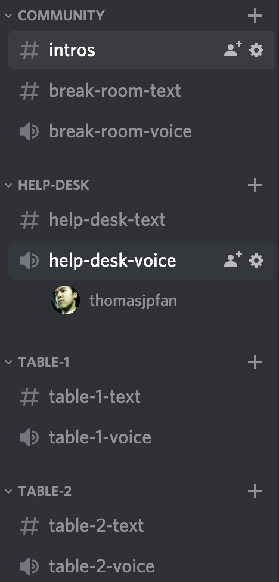
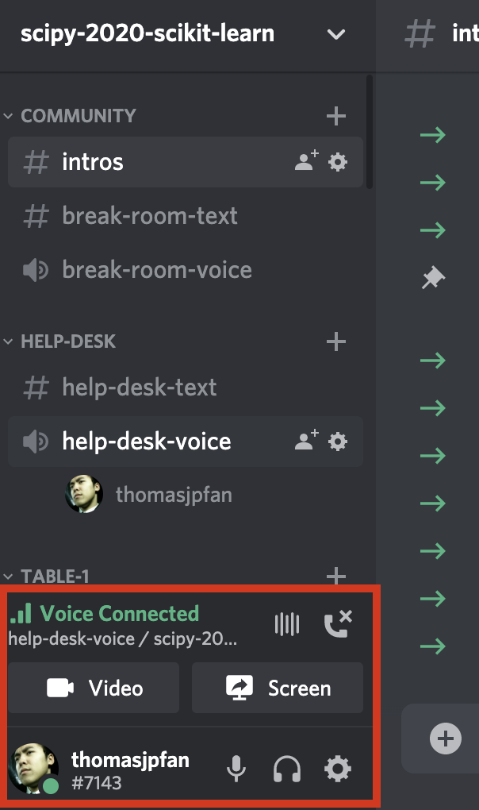
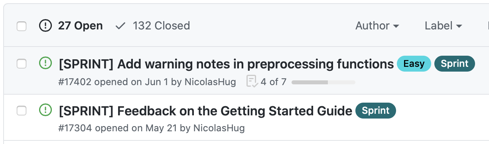

title: scikit-learn sprint - scipy 2020
use_katex: False
class: title-slide

# scikit-learn sprint - scipy 2020

.larger[Thomas J. Fan] 
*scikit-learn core developer* 
@thomasjpfan 
<a href="https://www.github.com/thomasjpfan" target="_blank"></a>
<a href="https://www.twitter.com/thomasjpfan" target="_blank"></a>
<a class="this-talk-link", href="https://github.com/thomasjpfan/scipy-2020-scikit-learn-sprint-intro" target="_blank">
This talk on Github: thomasjpfan/scipy-2020-scikit-learn-sprint-intro</a>

---

class: middle

# Resources for getting started

## Getting started with contributing to scikit-learn
- https://www.youtube.com/watch?v=5OL8XoMMOfA

## Example to contributing to scikit-learn
- https://www.youtube.com/watch?v=PU1WyDPGePI

---

class: middle

# Logistics

## Scipy slack on channel: #sprint-scikit-learn

## Discord for this sprint: https://discord.gg/8Wm9kyY

## During and after the sprint: https://gitter.im/scikit-learn/dev

### Sprint will only be for *Saturday*

---

# Discord!

.grid.grid-middle[
.grid-4[

]
.grid-8[
- Join one of the tables when you come in!
- Prefer to join a table with someone already there and introduce yourself!
- Hop into the `help-desk-voice` channel to ask questions!
]
]

---

# Discord (When in a voice channel)

.grid.grid-middle[
.grid-4[

]
.grid-8[
## You can share your screen or camera!
]
]

---

# Finding First Issues

- **First contribution:** Start with something simple to get use to the pull request process

- [Good first issue label](https://github.com/scikit-learn/scikit-learn/issues?q=is%3Aopen+is%3Aissue+label%3A%22good+first+issue%22)
- [Sprint label](https://github.com/scikit-learn/scikit-learn/issues?q=is%3Aopen+is%3Aissue+label%3ASprint+)

---

class: chapter-slide

# Have Fun! :)
